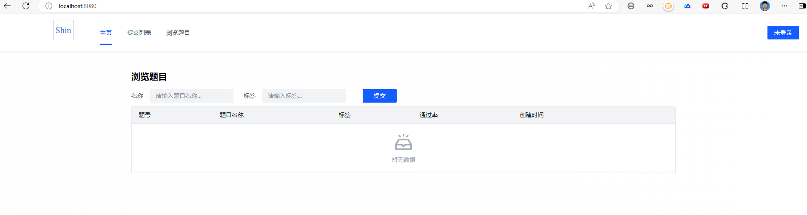
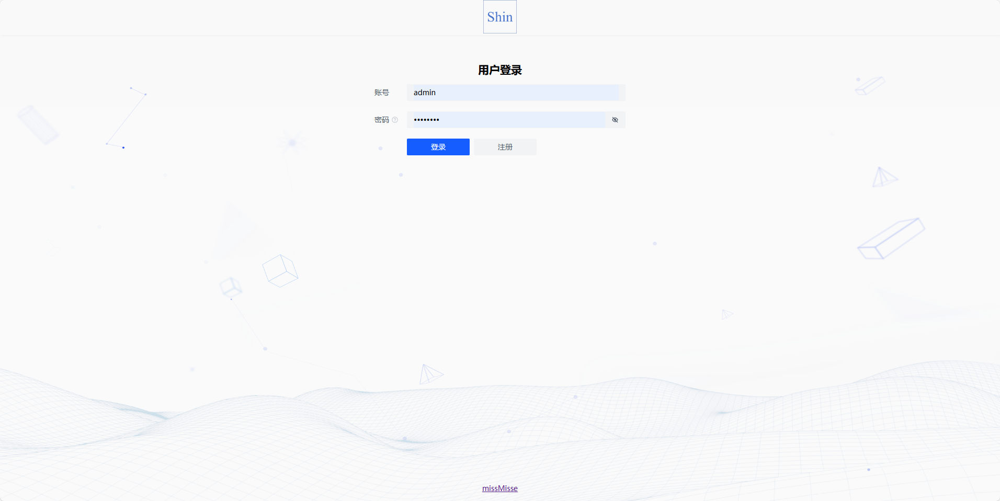
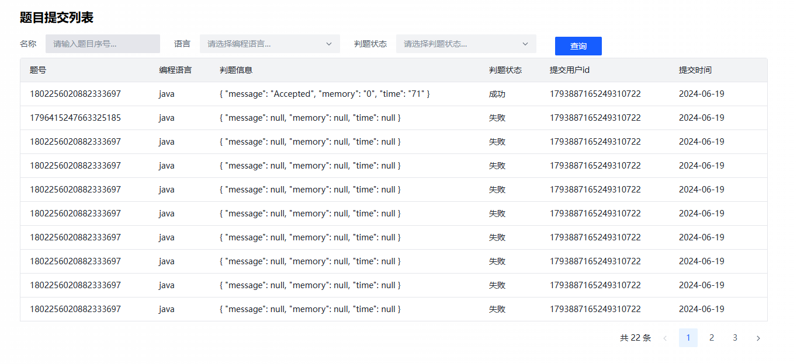
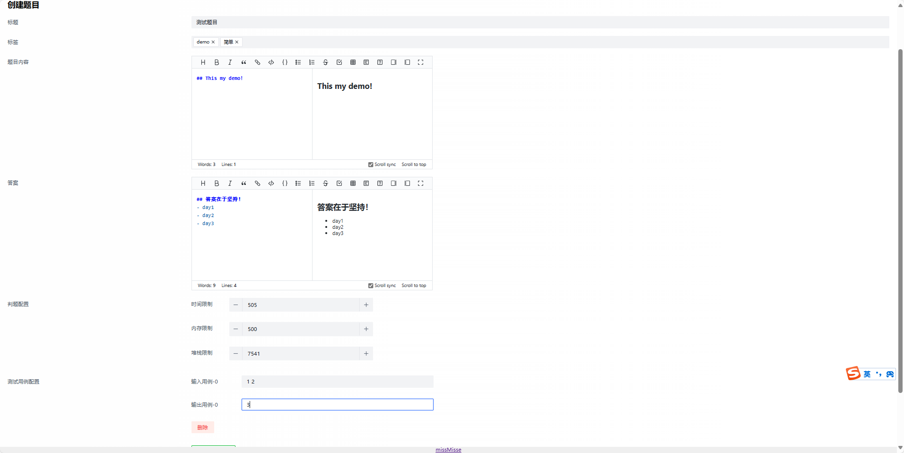
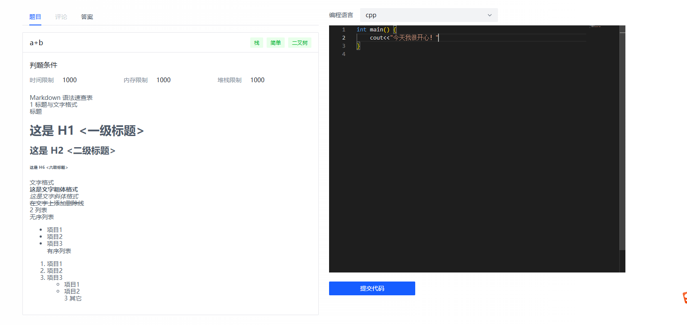

# xin-oj-frontend
## 整体框架
- 基于Vue3 + Arco Design组件库，简单实现了在线做题、题目列表、用户登录与注册等等页面。
- 使用Vue-Cli脚手架，定义了全局页面布局和通用前端模板。
- 使用openapi 工具根据后端的Swagger接口文档自动生成请求后端的代码。
## 具体细节
- 在题目模块，管理员定义题目时使用了富文本编辑器（ByteMD开源）。
- 在做题页面，基于Webpack整合了Monaco Editor 代码编辑器组件，可以根据不同的语言实现不同的高亮显示。
- 在提交列表页面，通过自定义插槽解析数据。
- 全局权限通过Vue Router路由中的meta属性，增加一个access字段来定义页面权限，对于非管理员权限通过hidden字段实现页面的显隐。

### 具体展示
- 整体页面

- 登录页面

- 题目提交列表

- 创建题目(markdown)

- 做题页面(没有开发评论功能)

